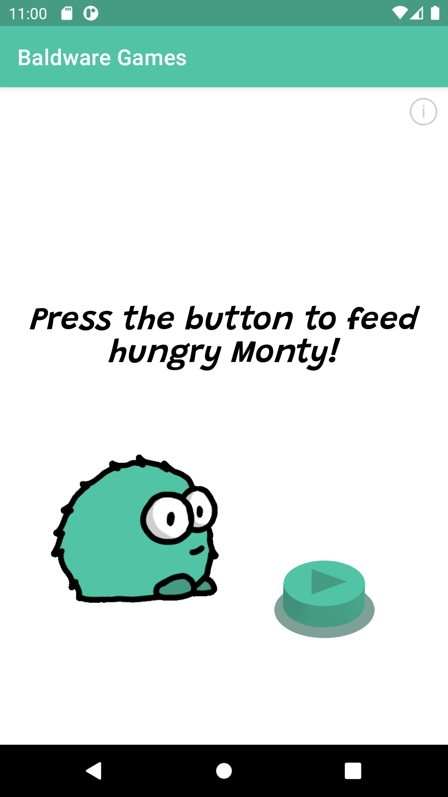
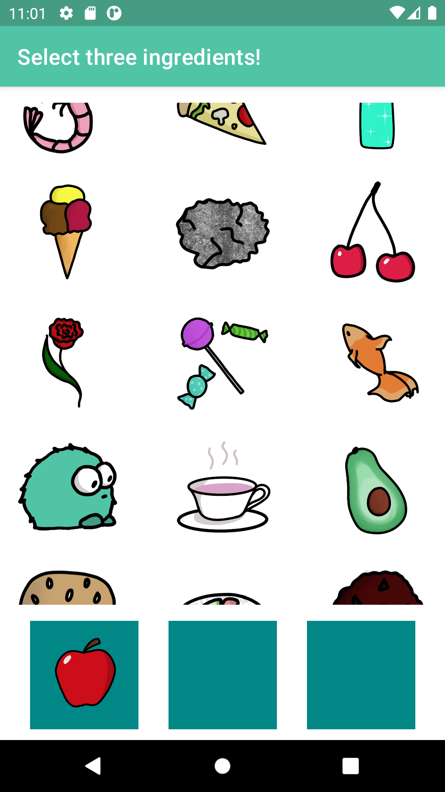
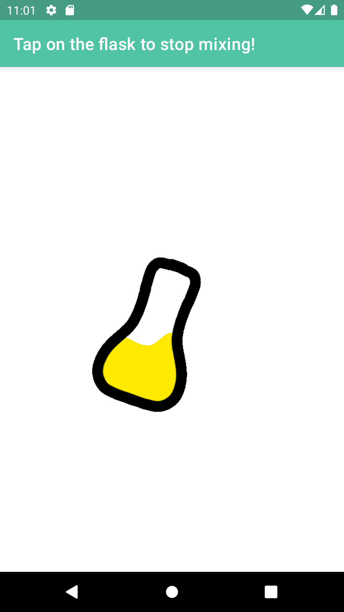
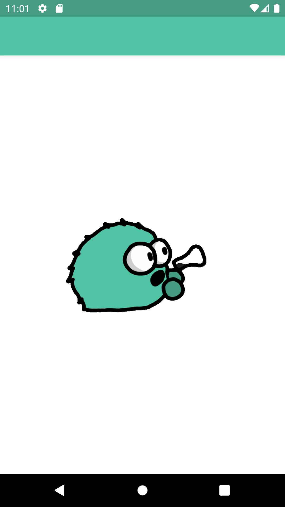
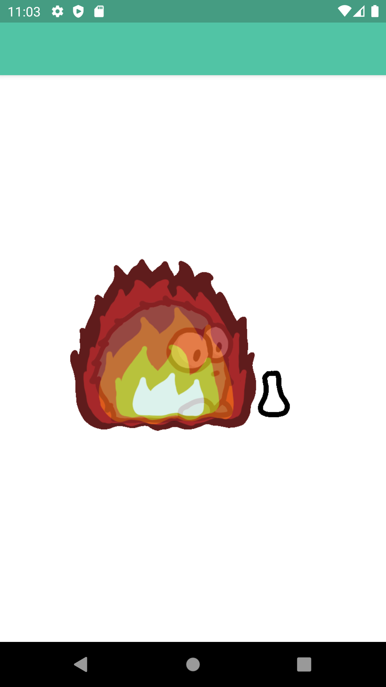
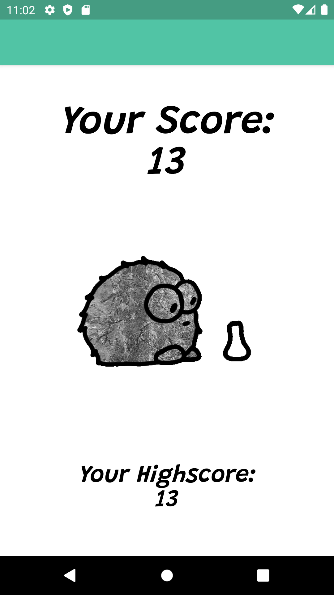
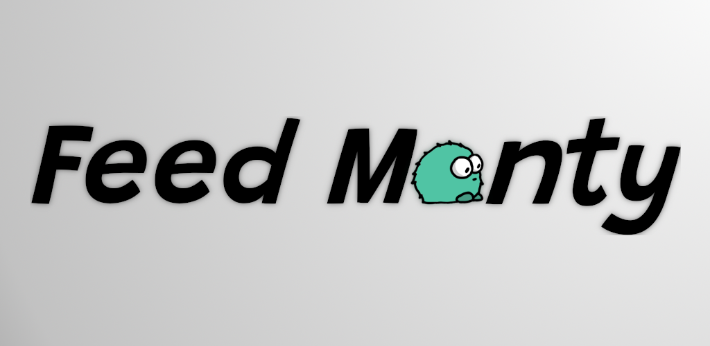

# FeedMonty!
### The very first android native game I published on the play store. (500+ downloads)

### The store text:
The monster Monty is hungry and needs you to mix him a drink!  
Select three edible and/or non-edible objects, mix them together and Monty will rate them for you.  
But be aware: Montys reactions can be a bit crazy sometimes!

